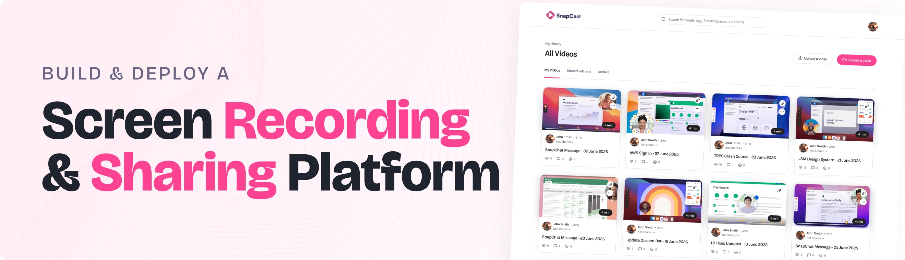

<div align="center">
  <br />
    
  </a>
  <br /><br />

  <div>
    
    
    
  </div>

  <h3 align="center">🎥 Full Stack Screen Recording & Video Sharing Platform</h3>
</div>

---

## 🤖 Introduction

This is a full-stack screen recording and video sharing platform built with **Next.js**, **Bunny.net**, and other modern technologies. It supports screen recording, video uploads, social authentication (via [Better Auth](https://www.better-auth.com)), video privacy controls, and AI-powered transcripts.

Users can:
- Record and upload videos
- Share via links
- Set videos public/private
- View AI-generated transcripts
- Search videos by metadata

> 💬 **Need help?** Join our active Discord community with over **50,000+ developers** helping each other grow:
<br />
<a href="https://discord.com/invite/n6EdbFJ" target="_blank">
  
</a>

---

## ⚙️ Tech Stack

| Technology     | Description |
|----------------|-------------|
| **Next.js**    | React framework with SSR, static generation & API routes |
| **Tailwind CSS** | Utility-first CSS framework for responsive UI |
| **TypeScript** | Static typing for JavaScript with improved tooling |
| **Bunny.net**  | Video CDN with streaming, edge storage, and token-based security |
| **Drizzle ORM**| Lightweight, type-safe ORM for SQL |
| **Better Auth**| Secure and scalable authentication & authorization |
| **Arcjet**     | Developer-first security platform for bot protection, rate limiting, and more |
| **Xata**       | Serverless PostgreSQL database with real-time branching & search |

---

## 🔋 Features

- ✅ **Authentication** with Google & Better-Auth  
- ✅ **Screen Recording** in-browser  
- ✅ **Video Uploading** with privacy toggles  
- ✅ **AI Transcripts** for video accessibility  
- ✅ **Video Metadata** including ID and URL  
- ✅ **Search Bar** to find content fast  
- ✅ **Shareable Links** for public/private videos  
- ✅ **Modern UI/UX** with responsive Tailwind styling  
- ✅ **Drizzle ORM** for type-safe queries  
- ✅ **Arcjet Integration** for security and bot protection  
- ✅ **Fully Responsive** across mobile, tablet, and desktop  
- ✅ **Reusable Components** and modular codebase  
- ✅ **Xata** for fast, scalable DB management  

---

## 🚀 Quick Start

### ✅ Prerequisites

Ensure you have the following installed:
- [Git](https://git-scm.com/)
- [Node.js](https://nodejs.org/en)
- [npm](https://www.npmjs.com/)

### 🔄 Clone the Repository

```bash
git clone https://github.com/adrianhajdin/screen_recording_sharing_app.git
cd screen_recording_sharing_app

````


## <a name="introduction">🤖 Introduction</a>

Built with Next.js and Bunny.net, this Full Stack Screen Recording & Video Sharing Platform includes user authentication with "Better Auth", screen recording, video uploads, and the ability to share videos via link. Users can set videos as public or private, view AI-generated transcripts, and access metadata like video ID and URL. A built-in search bar makes finding content fast and simple.

If you're getting started and need assistance or face any bugs, join our active Discord community with over **50k+** members. It's a place where people help each other out.

<a href="https://discord.com/invite/n6EdbFJ" target="_blank"></a>

## <a name="tech-stack">⚙️ Tech Stack</a>
- **[Arcjet]** is a developer-first security platform that integrates bot protection, rate limiting, email validation, and attack protection into your application with minimal code. It offers customizable protection for forms, login pages, and API routes, supporting frameworks like Node.js, Next.js, Deno, Bun, Remix, SvelteKit, and NestJS.

- **[Bunny.net]** is a developer-friendly video delivery platform offering global CDN, edge storage, adaptive streaming, and a customizable player. It simplifies video management with features like automatic encoding, token-based security, and real-time analytics. Ideal for seamless, secure, and scalable video streaming.

- **[Better Auth](https://www.better-auth.com/)** is a TypeScript-first authentication and authorization library that simplifies implementing secure login, two-factor authentication, and social sign-ins, all while supporting multi-tenancy. 
  
- **[Drizzle ORM](https://orm.drizzle.team/)** is a type-safe, lightweight ORM for SQL databases, providing a modern solution for interacting with databases using TypeScript, supporting migrations, queries, and schema management.  

- **[Next.js](https://nextjs.org/)** is a powerful React framework that enables the development of fast, scalable web applications with features like server-side rendering, static site generation, and API routes for building full-stack applications. 

- **[Tailwind CSS](https://tailwindcss.com/)** is a utility-first CSS framework that allows developers to design custom user interfaces by applying low-level utility classes directly in HTML, streamlining the design process.  
  
- **[TypeScript](https://www.typescriptlang.org/)** is a superset of JavaScript that adds static typing, providing better tooling, code quality, and error detection for developers, making it ideal for building large-scale applications.

- **[Xata](https://xata.io)** is a serverless PostgreSQL platform offering auto-scaling, zero-downtime schema migrations, real-time branching, and built-in full-text search. It provides a spreadsheet-like UI for intuitive data management, enhancing modern development workflows.


## <a name="features">🔋 Features</a>

👉 **Authentication**: Secure user sign-up and sign-in with Better-Auth & Google.  

👉 **Screen Recording**: Capture your screen directly within the app for seamless video recording.  

👉 **Video Uploading**: Effortlessly upload videos with a simple interface, supporting both public and private settings.  

👉 **AI Transcripts**: Get AI-generated transcripts for uploaded videos, making content more accessible and searchable.  

👉 **Privacy Control**: Toggle video visibility between public and private, ensuring full control over your content.  

👉 **Arcjet Integration**: Easily implement bot protection, rate limiting, email validation, and attack protection with minimal code, enhancing your app's security.

👉 **Metadata**: Access video metadata, including unique video ID and URL, for easy sharing and referencing.  

👉 **Search Functionality**: Find your videos quickly with an intuitive search bar, streamlining navigation.  

👉 **Share Videos**: Share videos via unique links for easy access and distribution.  

👉 **Modern UI/UX**: Clean, responsive design built with Tailwind CSS for a sleek user experience.  

👉 **Database Integration**: Utilize Xata for real-time, scalable database management.  

👉 **Type-Safe Queries**: Benefit from Drizzle ORM’s type-safe queries for secure and efficient database interactions.  

👉 **Scalable Tech Stack**: Built with Next.js for a fast, production-ready web application that scales seamlessly.  

👉 **Code Reusability**: Leverage reusable components and a modular codebase for efficient development.  

👉 **Cross-Device Compatibility**: Fully responsive design that works seamlessly across all devices.  

And many more, including enhanced security and optimized video performance!


## <a name="quick-start">🤸 Quick Start</a>

Follow these steps to set up the project locally on your machine.

**Prerequisites**

Make sure you have the following installed on your machine:

- [Git](https://git-scm.com/)
- [Node.js](https://nodejs.org/en)
- [npm](https://www.npmjs.com/) (Node Package Manager)

**Cloning the Repository**

```bash
git clone https://github.com/adrianhajdin/screen_recording_sharing_app.git
cd screen_recording_sharing_app
```

**Installation**

Install the project dependencies using npm:

```bash
npm install
```

**Set Up Environment Variables**

Create a new file named `.env` in the root of your project and add the following content:

```env
# Next.js
NEXT_PUBLIC_BASE_URL=http://localhost:3000

# [Xata] Configuration used by the CLI and the SDK
# Make sure your framework/tooling loads this file on startup to have it available for the SDK
XATA_API_KEY=
DATABASE_URL_POSTGRES=

# Google
GOOGLE_CLIENT_ID=
GOOGLE_CLIENT_SECRET=

# BetterAuth
BETTER_AUTH_SECRET=
BETTER_AUTH_URL=http://localhost:3000

# Bunny
BUNNY_STORAGE_ACCESS_KEY=
BUNNY_LIBRARY_ID=
BUNNY_STREAM_ACCESS_KEY=

#ArcJet
ARCJET_API_KEY=
XATA_API_KEY=
```

Replace the placeholder values with your actual credentials. You can obtain these credentials by signing up on: [Better-Auth](https://www.better-auth.com), [Google Cloud](https://console.cloud.google.com), [Bunny.net], [Xata.io](https://xata.io), [Arcjet].

**Running the Project**

```bash
npm run dev
```

Open [http://localhost:3000](http://localhost:3000) in your browser to view the project.

